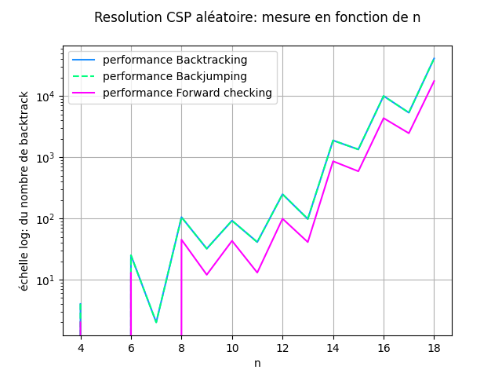

# Projet sur la Génération et la résolution des Problèmes de Satisfaction de Contraintes (CSP)

*ALLAGLO K Giovanni - 5A ICy - INSA Hauts-de-France*

## Table des matières

---

## Contexte

Ce projet a été développé dans le contexte du cours intitulé **Programmation par Contraintes**, mettant particulièrement l'accent sur les Problèmes de Satisfaction de Contraintes binaires, ainsi que sur les approches, algorithmes, heuristiques utilisés pour les résoudre.

Python (`3.12.0`) a été sélectionné comme langage de programmation pour ce projet.

### Sujet et objectifs

Le sujet porte sur deux objectifs :

1. **Générer aléatoirement des CSP binaires** selon 4 paramètres :
    - Le **nombre de variables** ;
    - La **taille des domaines** de ces variables ; 
    - La **densité du CSP** (la proportion des couples de variables qui possèdent une contrainte) ;
    - La **dureté des contraintes** du CSP (la proportion des couples de valeurs possibles qui sont autorisés pour chaque contrainte) ;

2. **Implémenter et appliquer 3 algorithmes** de recherche de solution de CSP :
    - Le **backtracking chronologique** "naïf" ;
    - Le **backjumping basé sur le graphe** (Graph-Based Backjumping) ;
    - Le **forward-checking**.

Aucun algorithme de filtrage ne sera appliqué avant de traiter les CSP.

Pour chaque algorithme, nous développerons deux versions. La première vérifiera simplement l'existence d'une solution (la première solution trouvée), tandis que la deuxième version aura pour objectif d'explorer l'intégralité de l'espace des solutions si le problème est satisfaisant.

Concernant la première version de chaque algorithme, les tests d'assignation partielle se feront dans le même ordre, garantissant ainsi que tous devraient renvoyer la même solution si elle existe.

### Format du rendu

Ce README sera rendu au format `pdf` en incluant les resultats de calculs de performance des différents algorithmes.
De plus, seront fournis **le code** et **des exécutables**.

Le code source est disponible sur le [dépôt Github](https://github.com/Giovanni-ALLAGLO/Projet_CSP.git).

## Programme

### Modélisation du problème

Un CSP est un ensemble $\{V,D,C\}$ avec :

$$
\begin{cases}
V = \{V_1, V_2, \dots, V_n\} &\text{: ensemble fini de variables}
\\
D = \{D_1, D_2, \dots, D_n\} &\text{: ensemble de domaines (un par variable)}
\\
C = \{C_1, C_2, \dots, C_m\} &\text{: ensemble fini de contraintes}
\end{cases}
$$

L’objectif étant de résoudre les problèmes de satisfaction de contraintes (CSP), nous avons de prime abord mis au point une structure  pour formaliser les données du problèmes.  Ainsi,  nous  avons  opté  pour  le  langage  python  qui  nous  permet d’aborder les CSP avec approche orientée objet. 

Une  première  classe  nommée  `Csp`  met  en  forme  le  problème. Elle contient les données telles que : 

- `name` :  le nom du problème 
- `nb_var` : le nombre de variables du problèmes 
- `nb_valeur` : la taille du domaine de définition des variables 
- `densite` : le pourcentage de la densité des liaisons dans le csp 
- `durete_contrainte` : le pourcentage de dureté des liaisons dans la csp 
- `domain`  :  le dictionnaire associant chaque variable et une liste de valeurs possibles qu’elle pourrait prendre. 
- `contraintes` : le dictionnaire dont la key est une variable du csp et dont la valeur est une liste d’Objets *Contrainte* qui lient la key et des variables id supérieur. 

Une  seconde,nommée  `Contrainte`  définit les contraintes entre deux variables du problème. Elle contient une liste des paires de valeurs possibles de ces dernières dans la csp. Par convention, les contraintes lient toujours une variable d’un niveau inférieur à une variable supérieure. Notons que la contrainte dans notre contexte définit l’ensembles des paires valeurs admises entre deux variables. 

Aussi nous avons les fonctions nécessaires à la construction de la csp : *Fonction d’ajout de variable,d’ajout de contraintes et d’affichage de la csp* 

### Generation des CSP

Dans cette partie nous avons deux fonctions géneratrices :

*   `gen_csp` générateur aléatoire de csp en fonctions des paramètres que sont le nombre de variables, la taille des domaines, la densité et la dureté des contraintes.
*   `csp_N_reine` générateur d'un csp pour le problème des N-reines.

#### CSP aléatoire

En fonction du nombre de variables, Nous calculons le nombre de liaisons qui doivent être générer dans le csp en fonction de la densité. Puis, Nous choisissons aléatoirement des liaisons entre deux variables de sorte à obtenir la densité voulue. 

En ce qui concerne la dureté des contraintes, on calcule aussi le nombre de couple de valeurs par liaisons à partir du nombre de couple possibles. En fonction de la dureté voulue, on choisira aléatoirement les paires de valeurs. 

#### CSP n-reines

La fonction `csp_N_reine` initialise un modèle CSP nommé *N-reines* avec *N* variables et domaines. Cela représente le problème des N-reines, où chaque variable correspond à une colonne, et le domaine de chaque variable représente les positions de lignes possibles.

La fonction itère sur les N colonnes, ajoutant chacune en tant que variable au modèle CSP. Le domaine de chaque variable inclut des valeurs de 1 à N, représentant les positions de lignes possibles pour une reine dans cette colonne.

La fonction génère des contraintes pour le problème des N-reines. Elle itère sur les paires de variables (colonnes) et crée des contraintes basées sur les règles du puzzle des N-reines.
     - Les reines ne peuvent pas être dans la même ligne .
     - Les reines ne peuvent pas être sur la même diagonale.

### Traitement 

#### Assignations

Dans les algorithmes de recherche de solution, une assignation (partielle ou totale) sera représentée par une liste $[a_1, a_2, \dots, a_n]$ pour un problème à $n$ variables, dans laquelle $a_i$ représente la valeur assignée à la variable $i$ le cas échéant, et `None` sinon.

#### Backtracking chronologique : BT** 

Implémentation de l’algorithme sur 2 versions : 

- une qui trouve la première solution et montre que *le problème est satisfiable (SAT) ou non (UNSAT)* 
- Une qui balaie toute l’espace solution 

Utilisation de la fonction  `consistent_assignment` pour vérifier si une assignation est cohérente. 

#### Graph Based Backjumping : BJ

Implémentation de l’algorithme sur 2 versions : 

- une qui trouve la première solution et montre que *le problème est satisfiable (SAT) ou non (UNSAT)* 
- Une qui balaie toute l’espace solution. 

Utilisation de la fonction  `consistent_assignment` pour vérifier si une assignation est cohérente. 

Utilisation de la fonction `find_parents` pour trouver les parents de chaque nœud. 

#### Forward-Checking : FC

Implémentation de l’algorithme sur 2 versions : 

- une qui trouve la première solution et montre que *le problème est satisfiable (SAT) ou non (UNSAT)* 
- Une qui balaie toute l’espace solution. 

Utilisation de la fonction `revise` afin de mettre à jour le domaine de définition des prochaines variables. 

### Méthode de calcul des performances

Pour le calcul des performances nous étudierons 
- le temps d'execution
- le nombre de tests pour l'assignation partielle consistente
- le nombre de backtrack
en faisant varier les paramètres de `gen_csp`. Par défaut on aura le CSP gen("graphe csp{i}", 8 , 8, 0.7,0.2 ) et lors des tests, on ne fera que varier les valeurs du paramètre concerné.

#### Cas particulier des N-reines

*complexité temporelle*

.

.

*Nombre de test d'assignation cohérente*

.

.

*Nombre de backtrack*

.

.

**Remarque**:

Les performances du backtraking et du backjumping sont similaires au niveau du nombre de tests sur les assigantions cohérentes: Cela est du en parti à la structure dense du csp N-reines.

Le forward checking offre des meilleurs performances tant sur la complexité temporelle que sur le nombre de backtrack et de test de consistance. L'algorithme de filtrage intégré, permet de réduire l’espace de recherche.

---
#### CSP aléatoire : En fonction de la taille 

*complexité temporelle*

.

.

*Nombre de test d'assignation cohérente*

.

*Nombre de backtrack*

.

**Remarque**:

Pour les 3 algorithmes, on remarque un pic lorsque la taille du domaine `nb_valeur` est égale à 8.
Le forward cheking effectue moins d'opération de test de cohérence et de backtrack comme on pouvait l'espérer.

Pour les performances temporelles, de [4;7]  du forward est meilleur à celui du backjumping, et moins bon que celui du backtraking.
De [7;10] Les performances temprelles du forward checking décline.
De [10;12] La complexité du FC s'améliore progressivement face aux 2 autres algorithmes.

Le backtracking est le moins bon candidat pour des csp avec des taille de domaines élevées.

---
#### CSP aléatoire : En fonction du nombre de variable

.

.

*Nombre de test d'assignation cohérente*

.

*Nombre de backtrack*

.

**Remarque**:

D'après la courbe logarithmique, les performances du FC est meilleur et BJ se rapproche de ses performances.

Le backtracking est le moins bon candidat pour des csp avec plusieurs variables.
---

#### CSP aléatoire : En fonction de la densité

.

.

*Nombre de test d'assignation cohérente*

.

*Nombre de backtracks*

.

**Remarque**:

Le FC présente de loin les meilleures performances suivi du backjumping.
En agissant sur la densité sur des csp de petites tailles, le backtraking fait à peu près jeu égale avec le backjumping.

On peut aussi noter un pic de valeur lorsque la densité est égale à 0.5

---

#### CSP aléatoire : En fonction de la dureté

.

.

*Nombre de test d'assignation cohérente*

.

*Nombre de backtracks*

.

**Remarque**:

Le backjumping présente globalement les meilleures performances temporelles sur des petits csp.
En agissant sur la dureté sur des csp de petites tailles, le FC, suivi du backjumping, parait le plus stable  en terme de nombre de tests et de backtrack.

On peut aussi noter un pic de valeur lorsque la dureté est égale à 0.7

---

### Exécutables

Premièrement j’ai remis en forme mon code python issu du notebook afin d’obtenir un projet python avec des paquets. 

Avec le convertisseur **auto-py-to-exe** j’ai converti mes fichiers main.py en main.exe 

Concernant les tests : 

Pour chaque algorithme (BT,BJ et FC) 2 versions: 

- une avec des csp aléatoires (mainFC2.exe,mainBJ2.exe, mainBT2.exe) 
- une avec les problèmes des n-reines (mainFC1.exe,mainBJ1.exe, mainBT1.exe) 

**Résultats des exécutables :**\ Un fichier .txt contenant les différentes solutions et temps d'exécution. 
